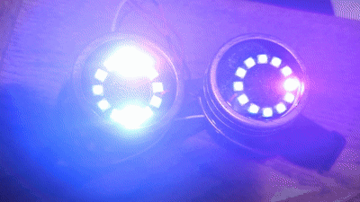

# Secret Agent Goggle

## Overview
This project is based on Adafruit’s [Kaleidoscope Eyes](learn.adafruit.com/kaleidoscope-eyes-neopixel-led-goggles-trinket-gemma) tutorial. Because the tutorial was originally published in 2013, some of its hardware, wiring instructions, and code are now outdated. This version modernizes the project using two WS2812 LED rings and an ESP32-C3 SuperMini.




## Hardware
ESP32-C3 dev board — one per pair. Native USB, and the silkscreen prints real GPIO numbers (no NodeMCU D-label translation)
2x 12-pixel NeoPixel rings — WS2812B, wired in series, 24 pixels total
5V power — USB pack or LiPo. Not the 3V3 pin

### Wiring

```
ESP32-C3 GPIO4  ──►  Ring 1 DI
Ring 1 DO       ──►  Ring 2 DI
5V              ──►  both rings VCC
GND             ──►  both rings GND  AND  ESP32-C3 GND
```

The shared ground between the board and the LEDs is not optional. Without it
the data line has no voltage reference and the strand stays dark no matter what
else is correct.

Optional but recommended: a 300–500Ω resistor in the data line, and a 1000µF
capacitor across the power rails at the first pixel.

### Phase 1
Control two 12-LED WS2812 rings using an ESP32-C3 SuperMini. Rings display a synchronized rotating rainbow that smoothly fades in and out, with brightness limited for USB-powered testing.


### Phase 2
Add a second pair of ESP32-C3 goggles that communicates wirelessly with the first. The original goggles act as the master, controlling the colors, patterns, and timing of any subsequent goggles. The second pair follows as the synchronized receiver.

__Received Signal Strength Indicator__
Measures how "loud" the incoming packets are, in dBm. It is always negative. The closer it is to 0, the "louder" it is.


### Phase 3
Phase 3 turns the synchronized lights into a visual communication system. Specific sequences of colors, flashes, and movement encode predefined messages that can be sent from one pair of goggles and displayed by the other.

