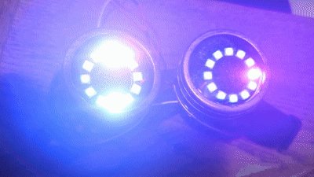

# Secret Agent Goggle

## Overview
This project is based on Adafruit’s [Kaleidoscope Eyes](learn.adafruit.com/kaleidoscope-eyes-neopixel-led-goggles-trinket-gemma) tutorial. Because the tutorial was originally published in 2013, some of its hardware, wiring instructions, and code are now outdated. This version modernizes the project using two WS2812 LED rings and an ESP32-C3 SuperMini.




## Hardware
ESP32-C3 dev board — one per pair.
2x 12-pixel NeoPixel rings — WS2812B, wired in series, 24 pixels total
5V power — USB pack or LiPo. Not the 3V3 pin

### Wiring

```
ESP32-C3 GPIO4  ──►  Ring 1 DI
Ring 1 DO       ──►  Ring 2 DI
5V              ──►  both rings VCC
GND             ──►  both rings GND  AND  ESP32-C3 GND
```

The shared ground between the board and the LEDs is not optional. Without it
the data line has no voltage reference and the strand stays dark no matter what
else is correct.

Optional but recommended: a 300–500Ω resistor in the data line, and a 1000µF
capacitor across the power rails at the first pixel.

## The hub (Arduino UNO Q)

Optional. The goggles work standalone — the hub adds a dashboard that shows
every pair at once with live RSSI, which is how you tune `RSSI_NEAR`.

The UNO Q **cannot join the mesh directly**: its radio is a Qualcomm WCN3980
and ESP-NOW is Espressif-only. Instead it hosts a wifi network, the goggles
join as clients and speak UDP, and joining also pins them all to one channel —
which is what ESP-NOW needs anyway, so peer-to-peer proximity keeps working
underneath.

### Setup

```bash
sudo nmcli device wifi hotspot ifname wlan0 ssid goggles-hub password gogglesgoggles
sudo nmcli connection modify Hotspot 802-11-wireless.channel 11 802-11-wireless.band bg
sudo nmcli connection up Hotspot
```

**Each of these kills your SSH session** — they reconfigure the interface
you're connected over. That looks like the terminal hanging. It isn't; the
command usually succeeded. Rejoin `goggles-hub` from your laptop and SSH back
to `10.42.0.1`.

To avoid the drop, run them detached:

```bash
sudo nohup nmcli connection up Hotspot > /tmp/nm.log 2>&1 &
```

### Running it

```bash
nohup python3 -u hub.py > /tmp/hub.log 2>&1 &
```

Dashboard: **http://10.42.0.1:8080** (while joined to `goggles-hub`)

Stop it with `pkill -f hub.py`. `python3 hub.py` in the foreground will fail
with `Address already in use` if a background copy is already running — that
error means it's working, not broken.

### Checks

```bash
nmcli -f 802-11-wireless.channel connection show Hotspot   # confirm channel
pgrep -af hub.py                                           # is it running
ss -lntup | grep 8080                                      # is it listening
```

`iw` and `tmux` are **not installed** on the stock image — use the `nmcli` and
`nohup` equivalents above.

### Gotchas

- **Channel must match `HUB_CHANNEL` in the sketch** (both 11) and must differ
  from your home router's. 2.4 GHz non-overlapping channels: 1, 6, 11.
- The dashboard only lists goggles that **joined the hotspot and are sending
  telemetry**. A pair that failed to join falls back to standalone silently and
  never appears. For the real client list:
  `sudo iw dev wlan0 station dump` (if `iw` is installed) or check the serial
  monitor on the board for `hub found` vs `no hub - standalone`.
- `PATTERNS` in `hub.py` must stay in the same order as `patterns[]` in
  `goggles.ino`.
- Goggles look for the hotspot for 8 seconds at boot. If the UNO Q wasn't
  broadcasting yet, just reset the board.
- Needs 5V/3A. It's a Linux box — pulling power risks filesystem corruption.
- The first-run account password has **no recovery path**. Write it down.

### Reverting to your home wifi

```bash
sudo nmcli connection down Hotspot
sudo nmcli device wifi connect "YourSSID" password "yourpassword"
```

